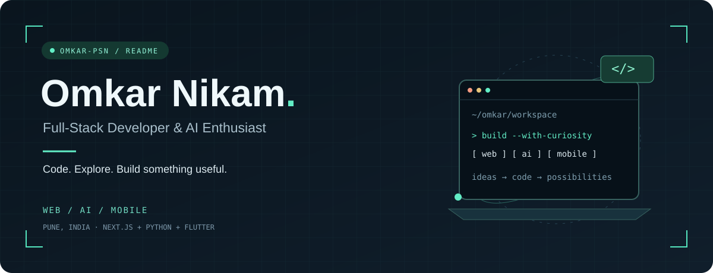
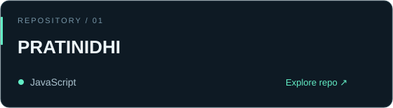
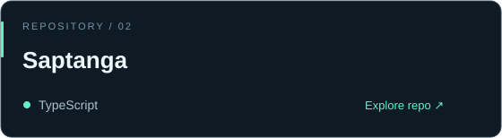
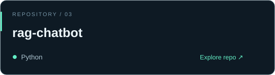
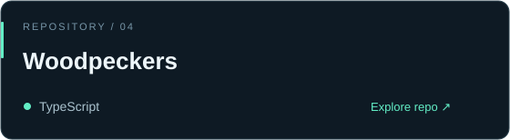
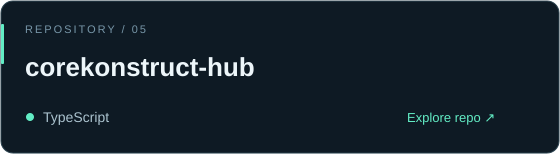
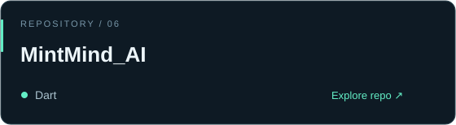

  

  
  &nbsp;
  

### `01 / THE DEVELOPER`

I'm **Omkar**, a full-stack developer and AI enthusiast based in **Pune, India**. My interests meet where web applications, artificial intelligence, and mobile experiences come together.

**My toolkit:** Next.js · TypeScript · Python · Flutter · Supabase

### `02 / TOOLS OF THE TRADE`

  
  
  
  
  

### `03 / SELECTED REPOSITORIES`

  
  

  
  

  
  

### `04 / START A CONVERSATION`

Interested in web, AI, or mobile development? **[Let's connect →](mailto:omkar.nikam3016@gmail.com)**

Explore more of my work in the pinned repositories and contribution activity below.

